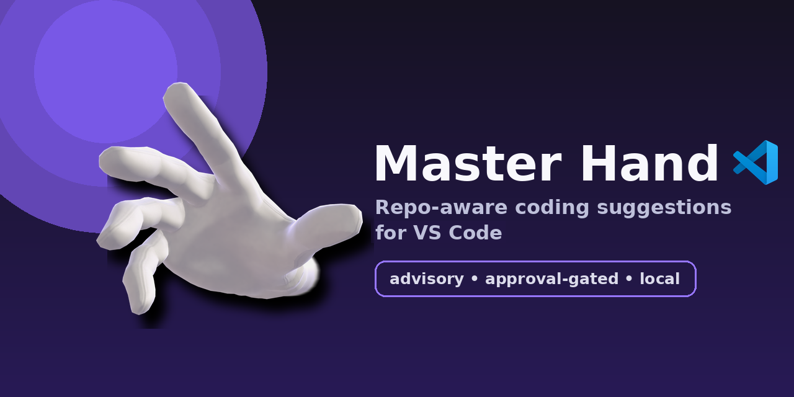

# Master Hand for VS Code

<p align="center">
  
</p>

**Models as helpers, not autopilot.**
Ask for context-aware suggestions, review the help, then approve what should happen.

> [!WARNING]
> Experimental extension. Port of the [Master Hand Neovim plugin](https://github.com/artie-mortus/Master-Hand). Keep backups and review every approved action.

## What Master Hand is

Master Hand is not an autonomous coding agent. It is a helper layer you open when you want a second set of eyes: give it a goal, let local context and optional models suggest next steps, then choose what to do.

| Feature | What it does |
| --- | --- |
| **Repo-aware next steps** | Combines open editors, diagnostics, git changes, recent edits, ripgrep hits, document symbols, and a bounded repo index. |
| **Approval boundary** | Suggestions are advisory; diffs, commands, and agent handoffs require explicit approval. |
| **Model optional** | Works with local heuristics only, local Ollama, Ollama Cloud, OpenAI-compatible APIs, OpenRouter, Anthropic, Pi, or login-backed CLI subscriptions (Codex/Claude/Gemini). |
| **Goal steering** | *Set Long-Term Goal* sets direction; *Set / Clear Short-Term Next Step* pins the next step, or Master Hand infers it from repo state. |
| **Agent handoff** | Approved suggestions can go to pi, Codex, or a custom argv command in a VS Code terminal. |

## Install / run

Not on the marketplace yet. From source:

```sh
git clone <this repo>
cd "Master Hand VSCode"
npm install
npm run compile
```

Then open the folder in VS Code and press **F5** (Run Extension), or package with `npx @vscode/vsce package` and install the `.vsix`.

## Quick start

Open the **Master Hand** icon in the activity bar, or run commands from the palette (all prefixed `Master Hand:`):

| Command | Equivalent of |
| --- | --- |
| Refresh Suggestions | `:MHSuggest` |
| Plan Suggestions | `:MHPlan` |
| Ask About Repo (or Selection) | `:MHAsk` |
| Explain Diagnostic or Selection | `:MHExplain` |
| Review Uncommitted Changes | `:MHReview` |
| Draft Commit Message | `:MHCommitMsg` (copies to clipboard) |
| List TODO / FIXME / HACK | `:MHTodo` |
| Infer Test Command (Queue for Approval) | `:MHTest` |
| Set Long-Term Goal | `:MHGoal` |
| Set / Clear Short-Term Next Step | `:MHNext` |
| Pick Model | `:MHModel` |
| Test Model Connection | `:MHModelStatus` |
| Provider Auth Status / Login | `:MHAuth` |
| Propose Diff (Queue for Approval) | `:MHDiff` |
| Queue Command for Approval | `:MHRun` |
| Show Context Snapshot / Repo Index / Status | `:MHContext` / `:MHIndex` / `:MHStatus` |
| Send Suggestion to External Agent | `:MHSend` |
| Reset Goals / Suggestions / All | `:MHReset` |
| Search Repo (ripgrep) | `:MHSearch` |

Sidebar suggestion items have inline actions: **accept** (send to agent), **dismiss**, **view**; the context menu adds postpone, copy agent prompt, open first referenced file. Pending approvals appear in their own section with approve/reject.

Native surfaces, beyond the palette:

- **Status bar** — `MH n` shows cached suggestions (plus a shield count when actions await approval); click to focus the sidebar. The sidebar icon carries a matching badge.
- **Welcome view** — an empty sidebar shows buttons for refresh / set goal / settings instead of a blank tree.
- **Editor right-click** — *Ask About Repo (or Selection)* and *Explain Diagnostic or Selection* on any editor selection.
- **Approval notifications** — queueing a command/test/diff pops a notification with **Approve / Preview / Reject** buttons, so approval is one click; the pending sidebar section stays available if you dismiss it.
- **Answers as rendered markdown** — Ask/Explain/Review results open in the built-in markdown preview, not raw text.
- **Commit messages** — *Draft Commit Message* writes the draft directly into the Source Control input box (clipboard fallback when the git extension is unavailable); also reachable from the Source Control view title menu.

Flow: **open → ask/goal → read suggestions → approve only useful help**.

## Requirements

- VS Code 1.90+
- `git` for status/diff context
- Optional: `rg` for repo search, `ollama` for local models, login-backed CLIs (`pi`, `codex`, `claude`, `gemini`) for subscription model calls and agent handoff

## Suggestion workflow

Suggestions run in two stages:

1. **Local heuristics** inspect steering goals, diagnostics, git diff, related files, recent edits, and the repo index. They are pure functions of the cached snapshot, so they always run first, even with `provider = "none"`. They watch for merge conflicts, oversized diffs, missing test updates, diagnostics (errors and warning hotspots in changed files), and goal/context signals.
2. **Optional model review** reads bounded, read-only context and returns extra suggestions.

Advisory commands (Review, Draft Commit Message, Explain, Ask) are read-only model outputs; nothing is applied, edited, or committed.

Proactivity:

- `passive` — default. Only explicit commands generate suggestions.
- `advisory` — editor changes debounce suggestion refreshes (`masterHand.suggestionFrequencyMs`), but still never edit files or run commands automatically.

Goal steering:

- **Direction (long-term)** — broad intent, set with *Set Long-Term Goal*.
- **Next step (short-term)** — immediate task, inferred from recent edits/changed files/diagnostics/model review, or pinned with *Set / Clear Short-Term Next Step* (leave empty to return to inference).
- Changing either goal clears stale suggestions and regenerates.

## Models

Set `masterHand.model.provider` (default `auto`: local Ollama when available; heuristics still work with nothing installed). `none` disables model calls.

*Pick Model* opens a two-step picker (provider, then model). For local Ollama the list comes from installed models; for API providers it is fetched live from the [models.dev](https://models.dev) catalog (with context window, thinking support, and $/Mtok in the description), falling back to the provider's own model-list endpoint, with a 24h on-disk cache for offline use. Picker and auth changes are **session-only**; put persistent defaults in settings.

```jsonc
// settings.json examples
{ "masterHand.model.provider": "none" }                       // heuristics only
{ "masterHand.model.provider": "ollama", "masterHand.model.name": "qwen3-coder:latest" }
{ "masterHand.model.provider": "openai", "masterHand.model.name": "gpt-4.1-mini" }
{ "masterHand.model.provider": "anthropic", "masterHand.model.name": "claude-sonnet-4-5" }
{ "masterHand.model.provider": "codex" }                      // logged-in Codex CLI
{
  "masterHand.model.provider": "cli",                          // custom subscription CLI
  "masterHand.model.command": ["my-ai-cli", "run", "$"],      // "$"/{prompt} = prompt; else stdin
  "masterHand.model.loginCommand": ["my-ai-cli", "login"]
}
```

API keys come from environment variables (`OPENAI_API_KEY`, `OPENROUTER_API_KEY`, `ANTHROPIC_API_KEY`, `OLLAMA_API_KEY`, or `masterHand.model.apiKeyEnv`). *Provider Auth Status / Login* shows status, runs CLI logins in a terminal, or takes a session-only key.

### Ranked routing

`masterHand.model.ranked` lists candidates (`{provider, name, rank, isLocal}`); a cheap cloud model (`masterHand.model.rankingModel`, defaulting to the highest-ranked cloud candidate) picks which candidate handles each request. `masterHand.model.cloudPolicy` = `fallback` (local first; default) or `best` (sort by rank). `masterHand.model.selection = "fixed"` disables routing.

## Agent handoff

Enabled by default: accepting a suggestion builds a prompt from it (title, reason, files, steering, constraints) and runs the configured agent in a VS Code terminal — created with `shellPath`/`shellArgs`, so the prompt is passed as argv, never through a shell string. Set `masterHand.agent.enabled = false` for feedback-only mode.

```jsonc
{ "masterHand.agent.adapter": "codex" }                        // codex exec <prompt>
{ "masterHand.agent.command": ["pi", "$"] }                    // custom argv; {prompt}/{root} work too
```

VS Code reloads externally changed files automatically; no sync command is needed.

## Safety model

- No automatic edits or command execution.
- Accepting a suggestion dispatches to an external agent unless `masterHand.agent.enabled = false`.
- Proposed diffs must pass path-safety checks (no absolute/`../`/`.git`/ignored paths, no binary patches, no quoted paths) and `git apply --check` before approval **and again** before apply.
- Commands use argv arrays, not shell strings; shell metacharacters and dangerous commands (`rm`, `sudo`, `git reset`, `git clean`) are blocked, plus an allowlist.
- *Infer Test Command* only queues the inferred command; it still passes the runner allowlist/blocklist and needs approval.
- Ignored paths (`.env*`, etc.) never reach model providers — including via staged diffs.
- Pending diffs live in memory, not on disk.
- Model/provider failures degrade to local heuristic suggestions.

## Configuration reference

All settings live under `masterHand.*` — see the Settings UI for the full annotated list: `proactivity`, `ignore`, `observation.*`, `model.*` (provider/name/endpoint/apiKeyEnv/timeoutMs/temperature/maxTokens/selection/cloudPolicy/ranked/rankingModel), `context.*` (bounds for files/diff/search/index), `commands.allowlist|blocklist|timeoutMs`, `agent.*`, `storage.enabled`.

List-valued settings (`ignore`, `commands.allowlist`, `commands.blocklist`, `model.ranked`) replace the defaults rather than merging; include every item you want active. Command templates (`model.command`, `model.loginCommand`, `agent.command`) must be argv arrays, not shell strings.

Goals and feedback persist per workspace (VS Code `workspaceState`); disable with `masterHand.storage.enabled = false`.

## Testing

```sh
npm test   # compiles, then runs headless unit tests over src/core
```
